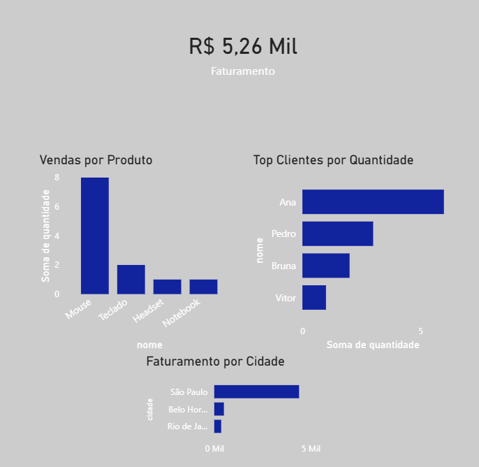

# projeto-dashboard-vendas
Dashboard de vendas com MySQL e Power BI

# 📊 Dashboard de Vendas | Power BI + MySQL

## 🚀 Sobre o projeto

Este projeto consiste na criação de um dashboard de vendas utilizando dados armazenados em um banco MySQL e visualizados no Power BI.

## 📌 Análises realizadas

* Faturamento total
* Vendas por produto
* Top clientes por quantidade
* Faturamento por cidade

## 🛠️ Tecnologias utilizadas

* MySQL
* SQL
* Power BI
* DAX

## 📷 Preview do Dashboard

## 📁 Arquivos

* `.pbix` → Dashboard Power BI
* `.sql` → Script do banco de dados

---

Projeto desenvolvido para fins de estudo e portfólio.
